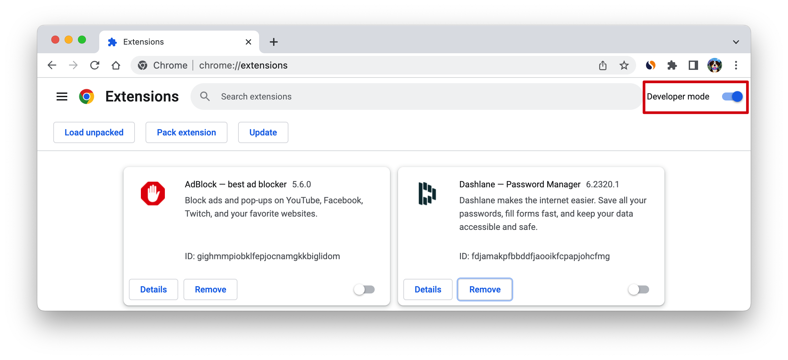
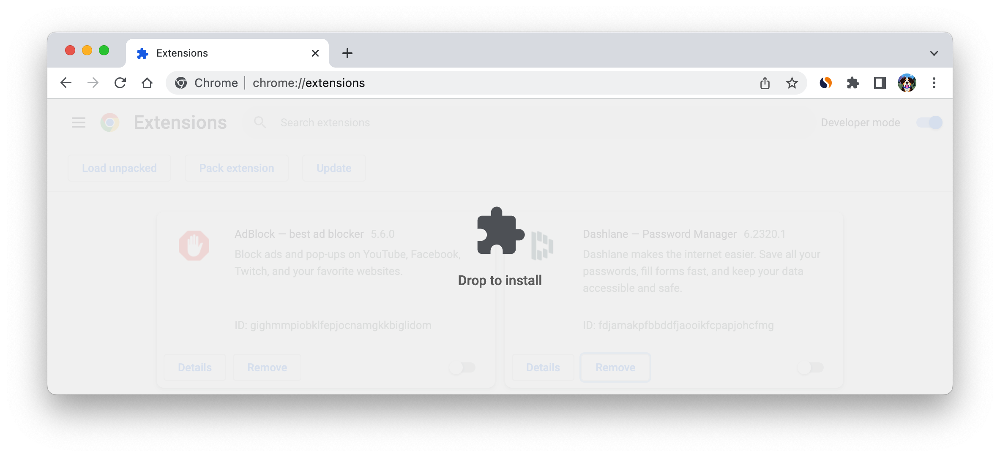
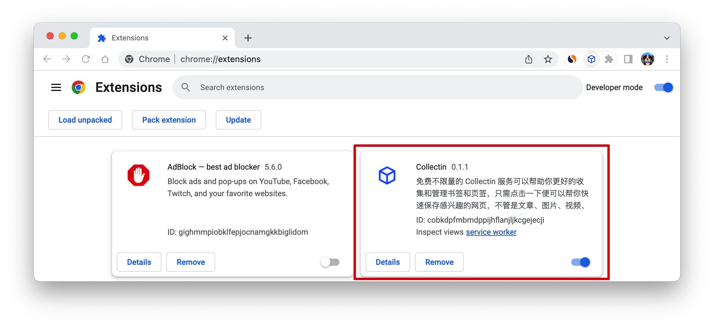
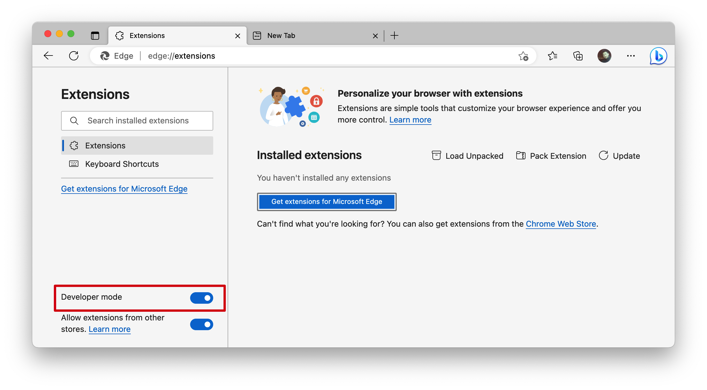
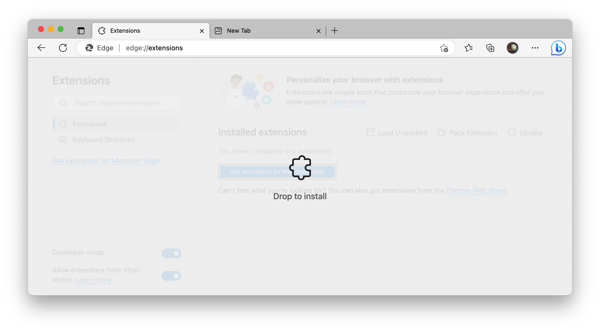
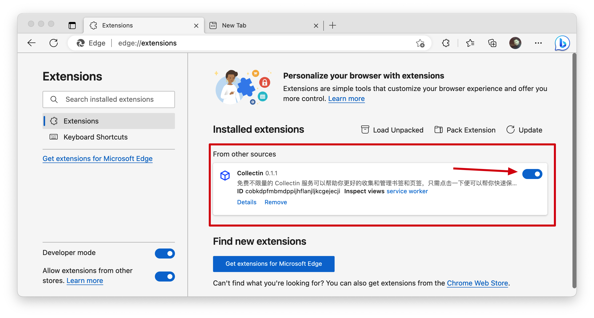
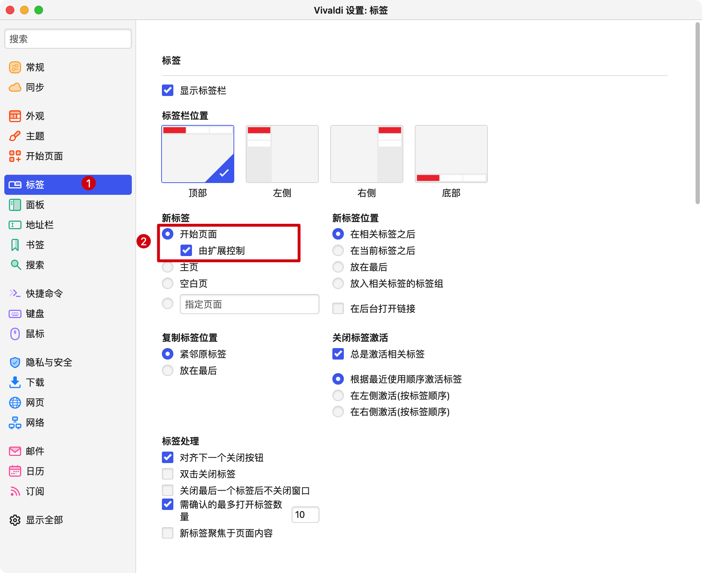

# 安装浏览器扩展

## Chrome 浏览器

### 从 Chrome 应用商店安装

应用商店（web store）地址：https://chrome.google.com/webstore

安装方式：

1. 在 Chrome 的扩展市场搜索 🔗 [Collectin](https://chrome.google.com/webstore/search/Collectin),

2. 在 Collectin 扩展的详情页面，点击按钮「添加至 Chrome」 即可，见 🔗 [此地址](https://chrome.google.com/webstore/detail/collectin/cobkdpfmbmdppijhflanjljkcgejecji)

### 本地安装-下载安装包

1. 点击下面的链接 🔗，将安装包下载到本地。

<ImageLink :link="extensionLinks.chrome" :img="chromeImg" text="Chrome 安装包" size=60 />

2. 在 Chrome 浏览器的 Extensions 页面中开启 Developer Mode

- 访问地址 🔗 <a href="chrome://extensions" >chrome://extensions</a> （复制链接打开）

3. 将下载的安装包拖入浏览器中

确认安装之后，在 extensions 列表中存在 Collectin 的扩展即表示安装成功 👏

点击左下角开启按钮，现在可以打开一个新的标签页试试～

## Edge 浏览器

现在，Edge 由于使用了 Chromium 内核，基本上与 Chrome 可以共享扩展的资源，不仅支持从 Chrome 应用商店安装扩展，也能支持 crx 的安装包，赞 👍

### 扩展市场安装

由于 Edge 的应用商店的审核周期相对较长，版本更新会有滞后；
同时目前 Edge 支持从 Chrome 的应用商店中下载安装扩展，所以建议可以从 Chrome 应用商店安装扩展，安装方式同 Chrome。

### 本地安装-下载安装包

1. 点击下面的链接 🔗，将安装包下载到本地。

<ImageLink :link="extensionLinks.edge" :img="edgeImg" text="Edge 安装包" size=60 />

2. 在 Edge 浏览器的 Extensions 页面中开启 Developer Mode

- 访问地址 🔗 <a href="edge://extensions" >edge://extensions</a> （复制链接打开）

3. 将下载的安装包拖入浏览器中

确认安装之后，开启使用即可 👏

## Valid 浏览器

> https://vivaldi.com/

该浏览器的扩展安装方式也可以兼容 Chrome 的扩展市场，打开「工具 - 扩展」或 vivaldi://extensions/ 页面即可进行扩展的安装。

- 可以选择进入 Chrome 应用商店进行安装
- 也可以采用本地包，本地宝可以直接采用 Chrome 的安装包

但要注意的是， Valid 浏览器默认设置的新标签页并没有交由扩展控制，需要设置：

## 国产浏览器

大部分国产浏览器如 QQ 浏览器、360 浏览器、搜狗浏览器、遨游浏览器等基本都是基于或兼容 Chrome 浏览器内核，所以可以直接使用 Chrome 浏览器的安装包，直接安装即可，如有遇到问题可随时反馈给我们。

## 其他浏览器

firefox 与 safari 的扩展中提供的接口有很大的差异导致部分功能不可用，需要一定时间开发，敬请期待
